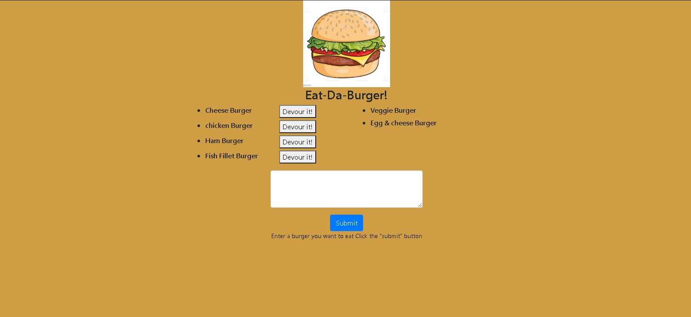

  # Welcome to Burger-logger (1.0.0)
  <a href="#">
    
  </a>


  ## Description 

  > In this web based application a burger logger is created with MySQL, Node, Express, Handlebars and a custom ORM. Eat-Da-Burger! is a restaurant app which performs the following function :
  

  *  It lets users input the names of burgers they'd like to eat

  *  Whenever a user submits a burger's name, the app will display the burger on the left side of the page -- waiting to be devoured.

  * Each burger in the waiting area also has a `Devour it!` button. When the user clicks it, the burger will move to the right side of the page.

The app will store every burger in a database, whether devoured or not.

## Screen shots





  ## Table of Contents

  * [Homepage](#homepage)
  * [Installation](#installation)
  * [Usage](#usage)
  * [Tests](#tests)
  * [Author](#author)
  * [Contributing](#contributing)
  * [License](#license)
  * [Questions](#questions)
  
  
  ## Homepage

  🏠 [Homepage](https://github.com/arpita-sahakar/burger-logger#readme)
  

  ## Installation
  Run the following command to install all the required libraries
  ```bash
  npm install
  ```

 
  ## Usage 
   Run the following command to start the server
  ```bash
  nodemon server.js
  ```


  ## Tests
  ```bash
  npm run test
  ```


  ## Author

  👤 **Arpita Kar**
  * GitHub: [@arpita-sahakar](https://github.com/arpita-sahakar)


  ## Contributing

  Contributions, issues and feature requests are welcome!

  Feel free to check [issues page](https://github.com/arpita-sahakar/burger-logger/issues). You can also take a look at the [contributing guide](https://github.com/arpita-sahakar/burger-logger).


  ## Questions

  Please send your questions and suggestions to [my email](arpita.sahaa@gmail.com)
  * GitHub: [@arpita-sahakar](https://github.com/arpita-sahakar)


  ## License

  Copyright © 2020 [Arpita Kar](https://github.com/arpita-sahakar).

  This project is [NPM](https://github.com/arpita-sahakar/burger-logger/blob/main/license) licensed.

  
 


